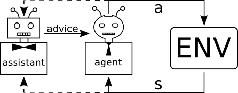

# Zero-Shot Assistance in Sequential Decision Problems

This repository contains the code for the paper  

> Sebastiaan De Peuter, Samuel Kaski (2023). [Zero-Shot Assistance in Sequential Decision Problems](https://arxiv.org/abs/2202.07364)". _accepted to the Thirty-Seventh AAAI Conference on Artificial Intelligence (AAAI-23)_.

## Introduction

The paper proposes _AI-Advised Decision-making_ (AIAD), in which we introduce an assistant that helps an agent solve a markov decision problem. The assistant does this primarily by giving the agent advice, for example on how it should act next. The assistant does not know the agent's reward function a priori, but must infer it through interaction.

In the experiments we report results from applying AIAD to two new benchmark use cases, day trip design and inventory management. We also compared AIAD to a number of baseline decision assistance methods. In this repository you will find the implementations of these two use cases and all the methods discussed in the paper. The implementations for the day trip design and inventory management experiment are located in the `trip_design` and `inventory_management` folders respectively.

## Requirements
* Julia **v1.0+**
* MCTS.jl **v0.5.1**
* POMDPs
* POMDPModelTools
* POMDPPolicies
* POMDPSimulators
* StatsBase
* Distributions
* HypothesisTests
* Plots
* JLD2
* FileIO
* LRUCache
* ProgressMeter
* CPUTime

## Contact
 * Sebastiaan De Peuter, sebastiaan.depeuter@aalto.fi
 * Samuel Kaski, samuel.kaski@aalto.fi